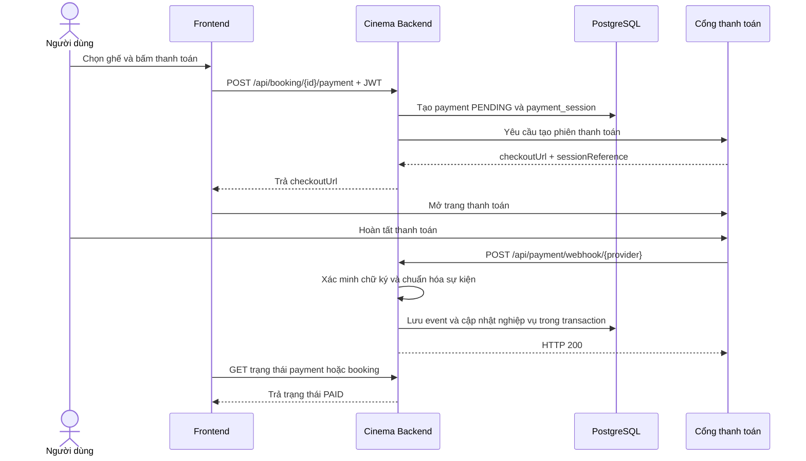

# Webhook thanh toán trong dự án Cinema

## 1. Mục tiêu của tài liệu

Tài liệu này giải thích webhook từ mức cơ bản và đề xuất cách triển khai endpoint sau theo đúng mã nguồn hiện tại của dự án Cinema:

```http
POST /api/payment/webhook/{provider}
```

OpenAPI mô tả endpoint này là **webhook từ cổng thanh toán**, không yêu cầu `BearerAuth`, nhận JSON có cấu trúc phụ thuộc từng nhà cung cấp và có các phản hồi `200`, `400`, `401`, `503`.

Nhánh được dùng để khảo sát là `feature/payment-webhook`, tạo từ commit mới nhất của `origin/develop`. Ở thời điểm viết tài liệu, dự án chưa có package `com.cinema.payment`; database đã có sẵn các bảng phục vụ thanh toán và webhook.

## 2. Webhook là gì?

Webhook là một API để hệ thống bên ngoài chủ động thông báo sự kiện cho backend của mình.

API thông thường của Cinema có hướng gọi:

```text
Frontend → Cinema Backend
```

Ví dụ người dùng lấy hồ sơ:

```http
GET /api/user
Authorization: Bearer <access-token>
```

Webhook thanh toán có hướng gọi:

```text
Cổng thanh toán → Cinema Backend
```

Ví dụ sau khi người dùng trả tiền thành công:

```http
POST /api/payment/webhook/payos
Content-Type: application/json
X-Signature: <chữ-ký-do-cổng-thanh-toán-tạo>

{
  "eventId": "evt-10001",
  "reference": "cinema-payment-52",
  "status": "PAID",
  "amount": 150000,
  "currency": "VND"
}
```

Tên header, tên trường và thuật toán chữ ký trong ví dụ chỉ mang tính minh họa. PayOS, VNPay, MoMo và các cổng khác có quy tắc riêng.

Webhook vẫn là một HTTP API. Điểm khác nằm ở người gọi và mục đích: frontend gọi API để yêu cầu thực hiện công việc, còn cổng thanh toán gọi webhook để báo một sự kiện đã xảy ra.

## 3. Tại sao không xác nhận thanh toán bằng frontend?

Luồng thanh toán thường chuyển người dùng sang trang của cổng thanh toán rồi chuyển trình duyệt trở lại Cinema. URL trở về chỉ phục vụ trải nghiệm giao diện, không nên được dùng làm bằng chứng thanh toán vì:

- Người dùng có thể đóng tab trước khi quay lại.
- Mạng của người dùng có thể mất kết nối sau khi tiền đã được trừ.
- Tham số trên URL trở về có thể bị người dùng sửa.
- Cổng thanh toán có thể hoàn tất giao dịch sau khi trang frontend đã hết thời gian chờ.

Backend chỉ chuyển booking sang `PAID` sau khi nhận webhook đã xác minh, hoặc sau khi chủ động gọi API cổng thanh toán để đối soát.

## 4. Luồng tổng thể trong Cinema



Webhook là xử lý bất đồng bộ. Request tạo payment có thể trả `PENDING`; kết quả cuối cùng được cập nhật sau khi webhook tới. Frontend có thể gọi API xem trạng thái định kỳ để hiển thị kết quả.

## 5. Vì sao webhook không dùng JWT?

OpenAPI khai báo:

```yaml
/payment/webhook/{provider}:
  post:
    security: []
```

JWT xác thực người dùng của Cinema. Cổng thanh toán không đăng nhập bằng tài khoản người dùng và không có JWT của họ. Vì vậy webhook dùng **chữ ký webhook** để xác minh server gửi request.

Mã nguồn hiện tại có `AuthFilter` bảo vệ:

```java
"/user/*", "/booking/*", "/admin/*", "/wallet/*"
```

`/payment/*` không nằm trong các pattern này, phù hợp với `security: []`. Không cần thêm webhook vào `AuthFilter`. Nếu thêm, cổng thanh toán sẽ luôn nhận `401` vì không có JWT.

`security: []` không có nghĩa endpoint không được bảo vệ. Cách bảo vệ của webhook là:

1. Cổng thanh toán tạo chữ ký từ payload và secret.
2. Backend đọc request body nguyên bản.
3. Backend dùng secret tương ứng để tính lại chữ ký.
4. Backend so sánh chữ ký nhận được với chữ ký vừa tính.
5. Chỉ parse và xử lý nghiệp vụ khi chữ ký hợp lệ.

Secret webhook phải nằm trong biến môi trường, ví dụ:

```env
PAYOS_WEBHOOK_SECRET=...
```

Không ghi secret vào Git, source code hoặc log.

## 6. Endpoint đi qua dự án như thế nào?

Controller nội bộ nên khai báo:

```java
@WebServlet(urlPatterns = {"/payment/webhook", "/payment/webhook/*"})
public class PaymentWebhookController extends HttpServlet {
}
```

`ApiPrefixFilter` hiện nhận `/api/*`, bỏ phần `/api` rồi forward tới servlet. Vì vậy:

```text
URL công khai:  /api/payment/webhook/payos
Servlet nhận:   /payment/webhook/payos
PathInfo:       /payos
Provider:       payos
```

Nếu WAR được deploy với context path `/cinema`, URL đầy đủ sẽ là:

```text
https://example.com/cinema/api/payment/webhook/payos
```

URL đăng ký tại cổng thanh toán phải là URL HTTPS mà server của họ truy cập được. `localhost` chỉ dùng được khi thử thủ công hoặc qua tunnel phục vụ môi trường phát triển.

## 7. Database hiện có gì?

Database online đã có cấu trúc phù hợp với webhook.

### 7.1. `payments`

Lưu giao dịch thanh toán của booking:

| Cột | Vai trò |
|---|---|
| `payment_id` | ID thanh toán nội bộ |
| `booking_id` | Booking được thanh toán |
| `user_id` | Chủ booking |
| `method` | `WALLET` hoặc `GATEWAY` |
| `status` | Trạng thái payment |
| `amount`, `currency` | Số tiền và loại tiền phải đối chiếu |
| `checkout_url` | URL đưa người dùng tới cổng thanh toán |
| `failure_code` | Mã lỗi khi thất bại |
| `expires_at` | Thời điểm payment hết hạn |
| `completed_at` | Thời điểm hoàn tất |

Các trạng thái hợp lệ:

```text
PENDING → SUCCEEDED
PENDING → FAILED
PENDING → EXPIRED
SUCCEEDED → REVERSAL_PENDING → REVERSED
```

Database có unique index chỉ cho một payment `PENDING` hoặc `SUCCEEDED` đang tồn tại trên một booking. Service vẫn cần kiểm tra nghiệp vụ để trả lỗi dễ hiểu trước khi database từ chối.

### 7.2. `payment_sessions`

Bảng này ánh xạ mã tham chiếu của cổng thanh toán sang payment nội bộ:

| Cột | Vai trò |
|---|---|
| `gateway_name` | Tên provider, ví dụ `PAYOS` |
| `session_reference` | Mã đơn/phiên ở phía provider |
| `payment_id` | Payment của Cinema |
| `status` | `PENDING`, `COMPLETED`, `EXPIRED`, `FAILED` |

Webhook thường chỉ gửi `sessionReference` hoặc mã đơn hàng. Service tìm `payment_sessions` bằng cặp `(gateway_name, session_reference)`, sau đó lấy được `payment_id`.

### 7.3. `payment_events`

Đây là inbox lưu webhook:

| Cột | Vai trò |
|---|---|
| `provider` | Nhà cung cấp gửi webhook |
| `event_id` | ID duy nhất của sự kiện bên provider |
| `provider_transaction_id` | ID giao dịch bên provider |
| `verified_payload` | Payload đã qua xác minh chữ ký |
| `status` | `RECEIVED`, `PROCESSED`, `RECONCILE`, `FAILED` |
| `received_at`, `processed_at` | Thời điểm nhận và xử lý |

Ràng buộc sau chống xử lý lặp:

```text
UNIQUE(provider, event_id)
```

### 7.4. Các bảng nghiệp vụ liên quan

Khi thanh toán thành công, transaction còn có thể tác động tới:

- `bookings`: `PENDING_PAYMENT → PAID`, đặt `paid_at`, tăng `version`.
- `booking_seats`: `HELD → BOOKED`.
- `booking_vouchers`: `RESERVED` hoặc `APPLIED → USED`.
- `tickets`: tạo một vé cho mỗi ghế.
- `invoices`: tạo hóa đơn duy nhất cho booking.

Khi thất bại hoặc hết hạn, service cập nhật payment/session và áp dụng chính sách giải phóng ghế, voucher. Không nên giải phóng ghế ngay cho mọi sự kiện thất bại tạm thời nếu payment còn có thể được provider xử lý lại.

## 8. Cấu trúc package đề xuất

```text
src/main/java/com/cinema/payment/
├── controller/
│   └── PaymentWebhookController.java
├── service/
│   └── PaymentWebhookService.java
├── dao/
│   ├── PaymentDAO.java
│   ├── PaymentSessionDAO.java
│   └── PaymentEventDAO.java
├── dto/
│   └── request/
│       └── <Provider>WebhookRequest.java
├── entity/
│   ├── Payment.java
│   ├── PaymentSession.java
│   └── PaymentEvent.java
├── model/
│   ├── PaymentStatus.java
│   ├── PaymentEventStatus.java
│   └── VerifiedPaymentEvent.java
├── provider/
│   ├── PaymentProvider.java
│   ├── PaymentProviderRegistry.java
│   └── <Provider>PaymentProvider.java
└── exception/
    └── PaymentWebhookException.java
```

Tên `<Provider>` chỉ được thay thế sau khi nhóm chọn cổng thanh toán cụ thể.

### Trách nhiệm của từng lớp

| Thành phần | Trách nhiệm |
|---|---|
| Controller | Lấy provider, raw body và header; gọi service; trả HTTP status |
| Provider adapter | Xác minh chữ ký, parse payload riêng, chuẩn hóa event |
| Service | Điều phối nghiệp vụ, kiểm tra trạng thái, amount/currency và transaction |
| DAO | Truy vấn và cập nhật database bằng `EntityManager` do service truyền vào |
| Entity | Ánh xạ các bảng thanh toán |
| Request DTO | Biểu diễn JSON riêng của một provider sau bước xác minh raw body |
| `VerifiedPaymentEvent` | Mô hình nội bộ chung, chỉ chứa dữ liệu đã xác minh và chuẩn hóa |

## 9. Vì sao phải đọc raw body trước khi tạo DTO?

Nhiều cổng thanh toán tính chữ ký trên đúng chuỗi byte đã gửi. Hai JSON sau có cùng ý nghĩa nhưng byte khác nhau:

```json
{"amount":150000,"status":"PAID"}
```

```json
{
  "status": "PAID",
  "amount": 150000
}
```

Nếu Controller dùng Jackson parse JSON rồi serialize lại để kiểm tra chữ ký, thứ tự thuộc tính hoặc khoảng trắng có thể đổi và chữ ký sẽ sai. Luồng đúng là:

```text
InputStream → byte[] rawBody
            → verify(rawBody, headers, secret)
            → parse rawBody thành ProviderWebhookRequest
            → chuyển thành VerifiedPaymentEvent
```

## 10. Thiết kế provider adapter

Không đặt toàn bộ logic PayOS/VNPay/MoMo trong Controller. Một interface chung có thể có dạng:

```java
public interface PaymentProvider {
    String name();

    VerifiedPaymentEvent verifyAndParse(
            byte[] rawBody,
            Map<String, String> headers
    );
}
```

`PaymentProviderRegistry` chỉ trả về provider nằm trong danh sách hỗ trợ. Không khởi tạo class dựa trực tiếp trên chuỗi `{provider}` từ URL.

`VerifiedPaymentEvent` nên chứa dữ liệu chung:

```java
public record VerifiedPaymentEvent(
        String provider,
        String eventId,
        String providerTransactionId,
        String sessionReference,
        EventType type,
        long amount,
        String currency,
        String verifiedPayload
) {}
```

Đây không phải request DTO trực tiếp vì nó được tạo sau khi xác minh và chuyển đổi dữ liệu. Đặt trong `model` giúp phân biệt dữ liệu HTTP chưa đáng tin với dữ liệu nội bộ đã chuẩn hóa.

## 11. Luồng xử lý trong Controller

Pseudo-code:

```java
protected void doPost(HttpServletRequest req, HttpServletResponse resp)
        throws IOException {
    try {
        String provider = extractProvider(req.getPathInfo());
        byte[] rawBody = req.getInputStream().readAllBytes();
        Map<String, String> headers = copyRequiredHeaders(req);

        webhookService.receive(provider, rawBody, headers);
        resp.setStatus(HttpServletResponse.SC_OK);
    } catch (PaymentWebhookException ex) {
        writeProviderSafeError(resp, ex);
    }
}
```

Controller không cập nhật database và không tự quyết định booking có được chuyển sang `PAID` hay không.

## 12. Luồng xử lý trong Service

```text
1. Chuẩn hóa và kiểm tra provider trong URL.
2. Lấy đúng PaymentProvider từ registry.
3. Xác minh chữ ký trên raw body.
4. Parse và chuẩn hóa thành VerifiedPaymentEvent.
5. Mở một EntityManager và bắt đầu transaction.
6. Chèn payment_events với trạng thái RECEIVED.
7. Nếu (provider, event_id) đã tồn tại, coi là duplicate và trả 200.
8. Tìm payment_session bằng provider + sessionReference.
9. Khóa payment/booking cần cập nhật.
10. Đối chiếu amount, currency, mã giao dịch và trạng thái hiện tại.
11. Áp dụng chuyển trạng thái hợp lệ.
12. Cập nhật booking, ghế, voucher, ticket, invoice nếu cần.
13. Đặt payment_event thành PROCESSED và processed_at.
14. Commit transaction.
15. Trả 200 cho provider.
```

Nếu không ánh xạ được event với payment, hoặc số tiền không khớp, không nên đoán. Lưu event ở `RECONCILE` để đối soát và trả `200` nếu sự kiện đã được lưu bền vững. Nếu trả lỗi liên tục, provider sẽ retry cùng một dữ liệu nhưng không giải quyết được sai lệch nghiệp vụ.

## 13. Một transaction cho toàn bộ thay đổi nghiệp vụ

Các cập nhật sau phải thành công hoặc thất bại cùng nhau:

```java
EntityManager em = JPAUtil.getEntityManager();
try {
    em.getTransaction().begin();

    eventDAO.insert(em, event);
    paymentDAO.markSucceeded(em, paymentId, completedAt);
    paymentSessionDAO.markCompleted(em, sessionId);
    bookingDAO.markPaid(em, bookingId, completedAt);
    bookingSeatDAO.markBooked(em, bookingId);
    bookingVoucherDAO.markUsed(em, bookingId);
    ticketDAO.createForBooking(em, bookingId);
    invoiceDAO.createForBooking(em, bookingId);
    eventDAO.markProcessed(em, eventId);

    em.getTransaction().commit();
} catch (Exception ex) {
    if (em.getTransaction().isActive()) {
        em.getTransaction().rollback();
    }
    throw ex;
} finally {
    em.close();
}
```

DAO sử dụng trong luồng này phải nhận cùng một `EntityManager`. Nếu mỗi DAO tự mở transaction, có thể xảy ra trạng thái payment là `SUCCEEDED` nhưng booking chưa `PAID`, hoặc booking đã `PAID` nhưng ticket chưa được tạo.

## 14. Idempotency: vì sao cùng webhook có thể đến nhiều lần?

Cổng thanh toán thường gửi lại webhook khi không nhận được `200` hoặc bị timeout. Tình huống thường gặp:

```text
Backend commit database thành công
→ response 200 bị mất trên mạng
→ provider tưởng xử lý thất bại
→ provider gửi lại event
```

Xử lý đúng:

```text
Lần 1: (PAYOS, evt-10001) chưa tồn tại
       → xử lý và tạo ticket

Lần 2: (PAYOS, evt-10001) đã tồn tại
       → không tạo ticket/hóa đơn lần nữa
       → trả 200
```

Unique constraint `(provider, event_id)` là lớp bảo vệ cuối cùng khi hai request trùng đến đồng thời. Service cần bắt đúng lỗi unique constraint và đọc bản ghi đã có thay vì biến duplicate thành lỗi `500`.

`Idempotency-Key` của `POST /booking/{id}/payment` và `event_id` của webhook giải quyết hai vấn đề khác nhau:

- `Idempotency-Key`: ngăn client tạo nhiều payment khi bấm hoặc gửi lại request.
- `provider + event_id`: ngăn backend xử lý cùng thông báo webhook nhiều lần.

## 15. Chống sự kiện đến sai thứ tự

Provider có thể gửi sự kiện trễ hoặc sai thứ tự:

```text
10:00:05 SUCCEEDED
10:00:08 PENDING cũ mới tới
```

Service phải kiểm tra state machine. Payment đã `SUCCEEDED` không được quay lại `PENDING` hoặc `FAILED`. Một quy tắc tối thiểu:

| Trạng thái hiện tại | Sự kiện | Kết quả |
|---|---|---|
| `PENDING` | thành công | `SUCCEEDED` |
| `PENDING` | thất bại | `FAILED` |
| `PENDING` | hết hạn | `EXPIRED` |
| `SUCCEEDED` | pending/thất bại đến trễ | bỏ qua, giữ `SUCCEEDED` |
| `SUCCEEDED` | bắt đầu hoàn tiền | `REVERSAL_PENDING` |
| `REVERSAL_PENDING` | hoàn tiền xong | `REVERSED` |
| `REVERSED` | sự kiện thanh toán cũ | bỏ qua, giữ `REVERSED` |

## 16. Đối chiếu dữ liệu trước khi cập nhật

Chữ ký hợp lệ chỉ chứng minh request đến từ provider và payload không bị sửa. Service vẫn phải đối chiếu:

- Provider trong URL có khớp session không.
- `sessionReference` có tồn tại không.
- Payment có thuộc đúng booking không.
- `amount` có bằng `payments.amount` không.
- `currency` có bằng `VND` không.
- Payment có đang ở trạng thái cho phép không.
- Provider transaction ID có bị gắn với giao dịch khác không.
- Booking có bị hủy hoặc hết hạn trước khi provider xác nhận không.

Ví dụ database yêu cầu `150000 VND` nhưng webhook hợp lệ báo `100000 VND`: lưu event thành `RECONCILE`, không chuyển booking sang `PAID`, rồi gọi API provider để đối soát hoặc xử lý thủ công.

## 17. Ý nghĩa HTTP response trong OpenAPI

| Status | Khi nào trả | Provider sẽ làm gì |
|---|---|---|
| `200` | Sự kiện đã được lưu bền vững; kể cả duplicate | Dừng retry |
| `400` | JSON hỏng hoặc thiếu dữ liệu bắt buộc | Có thể không retry tùy provider |
| `401` | Thiếu chữ ký hoặc chữ ký không hợp lệ | Không được cập nhật database nghiệp vụ |
| `503` | Không thể lưu sự kiện do database/dịch vụ tạm lỗi | Provider nên retry |

“Đã nhận bền vững” nghĩa là không trả `200` ngay khi vừa đọc request. Ít nhất bản ghi `payment_events` phải được commit để sự kiện không bị mất nếu ứng dụng dừng sau đó.

Nếu event đã lưu là `RECEIVED` nhưng xử lý nghiệp vụ chưa xong, có hai lựa chọn:

1. Xử lý đồng bộ ngay trong request rồi đổi sang `PROCESSED`.
2. Trả `200` sau khi lưu, sau đó một worker xử lý các event `RECEIVED`.

Dự án hiện chưa có message queue hoặc worker. Giai đoạn đầu nên xử lý đồng bộ trong một transaction; thiết kế trạng thái `RECEIVED` vẫn cho phép bổ sung worker sau này.

## 18. Xử lý từng loại sự kiện

### Thanh toán thành công

```text
payments.status          → SUCCEEDED
payments.completed_at    → thời điểm provider xác nhận
payment_sessions.status  → COMPLETED
bookings.status          → PAID
bookings.paid_at         → thời điểm thanh toán
booking_seats.status     → BOOKED
booking_vouchers.status  → USED
tickets                  → tạo theo từng booking_seat
invoices                 → tạo một hóa đơn
payment_events.status    → PROCESSED
```

### Thanh toán thất bại

```text
payments.status          → FAILED
payments.failure_code    → mã lỗi đã chuẩn hóa
payment_sessions.status  → FAILED
payment_events.status    → PROCESSED
```

Việc booking chuyển sang `EXPIRED` và giải phóng ghế/voucher phụ thuộc việc còn thời gian và còn payment khác có thể thử hay không.

### Hết hạn

```text
payments.status          → EXPIRED
payment_sessions.status  → EXPIRED
bookings.status          → EXPIRED nếu không còn payment hợp lệ
booking_seats.status     → RELEASED
booking_vouchers.status  → RELEASED
payment_events.status    → PROCESSED
```

### Hoàn tiền

```text
payments.status          → REVERSAL_PENDING hoặc REVERSED
bookings.status          → REFUND_PENDING hoặc REFUNDED
tickets.status           → REFUND_PENDING hoặc VOID
invoices.status          → REFUNDED khi hoàn tất
payment_events.status    → PROCESSED
```

## 19. Bảo mật cần có

1. Chỉ đăng ký URL HTTPS với provider.
2. Kiểm tra chữ ký trên raw body trước khi tin bất kỳ trường nào.
3. So sánh chữ ký theo constant time, chẳng hạn `MessageDigest.isEqual`.
4. Lưu secret trong biến môi trường.
5. Nếu provider gửi timestamp, từ chối request quá cũ để hạn chế replay.
6. Dùng unique `(provider, event_id)` để chặn xử lý lặp.
7. Giới hạn kích thước request body.
8. Chỉ chấp nhận `Content-Type` được provider quy định.
9. Không log secret, dữ liệu thẻ hoặc toàn bộ payload nhạy cảm.
10. Log `provider`, `eventId`, `sessionReference`, kết quả xử lý và correlation ID.
11. IP allowlist chỉ nên là lớp bổ sung vì dải IP provider có thể thay đổi; chữ ký vẫn là lớp xác thực chính.
12. Không dùng dữ liệu redirect ở frontend để chuyển payment sang thành công.

## 20. Quan hệ với module Wallet hiện tại

`WalletService.topUp()` trên `develop` đang mô phỏng nạp tiền thành công ngay trong request: tạo top-up `SUCCEEDED`, cộng số dư và ghi ledger. Khi tích hợp cổng thanh toán thật, nạp tiền qua gateway cũng cần mô hình bất đồng bộ:

```text
POST /wallet/top-up
→ tạo wallet_topup PENDING + payment_session
→ trả checkoutUrl
→ webhook hợp lệ
→ topup SUCCEEDED + cộng ví + tạo wallet_transaction
```

`payment_sessions` cho phép liên kết chính xác một session với `payment_id` hoặc `topup_id`, nên cùng endpoint webhook có thể xử lý cả thanh toán booking và nạp ví. Phần cập nhật số dư phải khóa bản ghi ví và tạo ledger trong cùng transaction để không cộng tiền hai lần.

## 21. Các bước triển khai code

### Bước 1: Chốt provider và hợp đồng chữ ký

Cần xác định:

- Tên provider dùng trong URL.
- Header chứa signature và timestamp.
- Thuật toán ký và cách canonicalize dữ liệu.
- Event ID, transaction ID, reference, amount, currency và status nằm ở đâu.
- Quy tắc retry và response mà provider yêu cầu.
- API truy vấn giao dịch để đối soát.

### Bước 2: Tạo entity và đăng ký JPA

Tạo `Payment`, `PaymentSession`, `PaymentEvent`, enum trạng thái và thêm entity vào `persistence.xml`, phù hợp cách dự án hiện liệt kê entity thủ công.

### Bước 3: Tạo DAO hỗ trợ transaction dùng chung

Các phương thức ghi dữ liệu nhận `EntityManager` từ service. Thêm truy vấn khóa payment/booking khi cập nhật để hai webhook đồng thời không xử lý cùng giao dịch.

### Bước 4: Tạo provider adapter

Triển khai verify raw body, parse DTO riêng và trả `VerifiedPaymentEvent`. Viết kiểm thử chữ ký bằng fixture chính thức của provider.

### Bước 5: Tạo `PaymentWebhookService`

Thêm duplicate handling, đối chiếu amount/currency, state machine, transaction cập nhật booking/payment và trạng thái `RECONCILE`.

### Bước 6: Tạo Controller

Ánh xạ `/payment/webhook/*`, đọc raw body một lần và trả đúng `200/400/401/503`. Không thêm endpoint vào `AuthFilter`.

### Bước 7: Hoàn thiện luồng tạo payment

`POST /api/booking/{id}/payment` phải tạo `payments` và `payment_sessions`, gửi mã tham chiếu duy nhất cho provider rồi trả `checkoutUrl`. Nếu không có bước này, webhook không có cách an toàn để ánh xạ về payment nội bộ.

### Bước 8: Quan sát và đối soát

Thêm log có cấu trúc, truy vấn event `RECONCILE`/`FAILED`, cơ chế retry event `RECEIVED` và cảnh báo khi tỷ lệ chữ ký sai hoặc xử lý lỗi tăng.

## 22. Các trường hợp phải kiểm tra

| Trường hợp | Kết quả mong đợi |
|---|---|
| Chữ ký đúng, payment đang `PENDING` | Cập nhật thành công và trả `200` |
| Chữ ký sai | Không ghi nghiệp vụ, trả `401` |
| JSON sai | Trả `400` |
| Event gửi lại | Không tạo vé/hóa đơn lần hai, trả `200` |
| Hai event giống nhau đến đồng thời | Chỉ một transaction thực hiện nghiệp vụ |
| Amount/currency sai | Không đánh dấu `PAID`, lưu `RECONCILE` |
| Event cũ đến sau `SUCCEEDED` | Không làm trạng thái đi lùi |
| Database tạm lỗi trước khi lưu event | Trả `503` để provider retry |
| Commit xong nhưng response bị mất | Lần retry được nhận diện là duplicate |
| Booking đã hết hạn nhưng provider báo thành công | Đưa vào đối soát theo chính sách nghiệp vụ |
| Webhook cho top-up gửi hai lần | Ví chỉ được cộng tiền một lần |

## 23. Kết luận kiến trúc

Trong dự án Cinema, webhook nên được xem là cửa vào công khai nhưng có chữ ký, thuộc module `payment`. Controller chỉ tiếp nhận HTTP; provider adapter xác minh và chuẩn hóa; service quản lý state machine cùng transaction; DAO thao tác database bằng cùng một `EntityManager`; `payment_events` đảm bảo lưu bền vững và idempotency.

Phần khung có thể triển khai độc lập với nhà cung cấp, nhưng không thể viết đúng phần chữ ký bằng cách đoán. Trước khi hoàn thiện code cần chốt một provider và dùng tài liệu chính thức của provider đó làm hợp đồng tích hợp.
